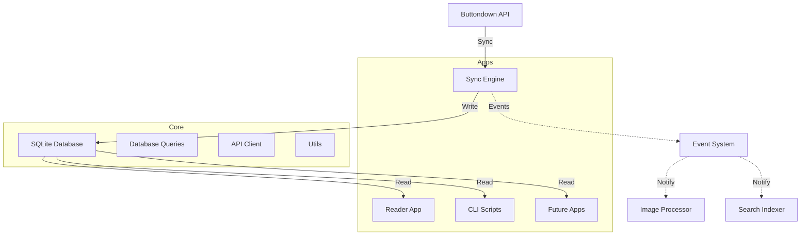

# Refactoring Roadmap

**Generated**: 2025-10-18
**Status**: Ready for Implementation
**Architecture Review**: See analysis in conversation context

This document provides a phased approach to improving the `letters` codebase architecture based on comprehensive analysis. Each phase is designed to be independently executable by separate agents/developers.

---

## Table of Contents

- [Phase 1: Foundation](#phase-1-foundation)
- [Phase 2: Developer Experience](#phase-2-developer-experience)
- [Phase 3: Type Safety & Configuration](#phase-3-type-safety--configuration)
- [Phase 4: Advanced Architecture](#phase-4-advanced-architecture)
- [Quick Wins](#quick-wins)
- [Context & Current State](#context--current-state)

---

## Phase 1: Foundation

**Goal**: Improve code organization and add essential infrastructure
**Estimated Effort**: 4-6 hours
**Dependencies**: None

### Task 1.1: Split DatabaseQueries into Domain Classes

**Current Problem**: `lib/db/queries.ts` is 503 lines with mixed concerns (emails, images, attachments, markdown).

**Implementation**:

1. Create new directory: `lib/db/queries/`

2. Create domain-specific query classes:

**File**: `lib/db/queries/emails.ts`

```typescript
import Database from 'better-sqlite3';
import type { Email } from '../../api/types.js';
import { logger } from '../../utils/logger.js';

export class EmailQueries {
  constructor(private db: Database.Database) {}

  /**
   * Upsert an email (insert or update if exists)
   */
  upsertEmail(email: Email, normalizedMarkdown?: string): void {
    const now = new Date().toISOString();
    const stmt = this.db.prepare(`
      INSERT INTO emails (
        id, subject, body, normalized_markdown, status, publish_date,
        creation_date, modification_date, slug, description,
        image_url, canonical_url, email_type, secondary_id,
        absolute_url, metadata, featured, synced_at
      ) VALUES (
        @id, @subject, @body, @normalized_markdown, @status, @publish_date,
        @creation_date, @modification_date, @slug, @description,
        @image_url, @canonical_url, @email_type, @secondary_id,
        @absolute_url, @metadata, @featured, @synced_at
      )
      ON CONFLICT(id) DO UPDATE SET
        subject = excluded.subject,
        body = excluded.body,
        normalized_markdown = excluded.normalized_markdown,
        status = excluded.status,
        publish_date = excluded.publish_date,
        modification_date = excluded.modification_date,
        slug = excluded.slug,
        description = excluded.description,
        image_url = excluded.image_url,
        canonical_url = excluded.canonical_url,
        email_type = excluded.email_type,
        secondary_id = excluded.secondary_id,
        absolute_url = excluded.absolute_url,
        metadata = excluded.metadata,
        featured = excluded.featured,
        synced_at = excluded.synced_at
      WHERE emails.modification_date <= excluded.modification_date
    `);

    stmt.run({
      id: email.id,
      subject: email.subject,
      body: email.body,
      normalized_markdown: normalizedMarkdown || null,
      status: email.status,
      publish_date: email.publish_date || null,
      creation_date: email.creation_date,
      modification_date: email.modification_date,
      slug: email.slug || null,
      description: email.description,
      image_url: email.image,
      canonical_url: email.canonical_url,
      email_type: email.email_type || 'public',
      secondary_id: email.secondary_id || null,
      absolute_url: email.absolute_url,
      metadata: email.metadata ? JSON.stringify(email.metadata) : null,
      featured: email.featured ? 1 : 0,
      synced_at: now,
    });

    logger.debug(`Upserted email: ${email.subject} (${email.id})`);
  }

  /**
   * Check if an email exists
   */
  emailExists(id: string): boolean {
    const stmt = this.db.prepare('SELECT 1 FROM emails WHERE id = ? LIMIT 1');
    return stmt.get(id) !== undefined;
  }

  /**
   * Get all emails (for export/debugging)
   */
  getAllEmails(): any[] {
    return this.db
      .prepare('SELECT * FROM emails ORDER BY publish_date DESC')
      .all();
  }

  /**
   * Get an email with local image references
   */
  getEmailWithLocalImages(emailId: string): {
    email: any;
    body: string;
  } | null {
    const emailStmt = this.db.prepare('SELECT * FROM emails WHERE id = ?');
    const email = emailStmt.get(emailId) as any;

    if (!email) {
      return null;
    }

    return {
      email,
      body: email.normalized_markdown || email.body,
    };
  }

  /**
   * Update normalized markdown for an email
   */
  updateNormalizedMarkdown(emailId: string, normalizedMarkdown: string): void {
    const stmt = this.db.prepare(`
      UPDATE emails
      SET normalized_markdown = ?
      WHERE id = ?
    `);

    stmt.run(normalizedMarkdown, emailId);
  }

  /**
   * Get emails without normalized markdown
   */
  getEmailsWithoutNormalizedMarkdown(limit?: number): any[] {
    const query = limit
      ? 'SELECT * FROM emails WHERE normalized_markdown IS NULL LIMIT ?'
      : 'SELECT * FROM emails WHERE normalized_markdown IS NULL';

    return limit
      ? this.db.prepare(query).all(limit)
      : this.db.prepare(query).all();
  }

  /**
   * Count emails without normalized markdown
   */
  countEmailsWithoutNormalizedMarkdown(): number {
    const stmt = this.db.prepare(`
      SELECT COUNT(*) as count
      FROM emails
      WHERE normalized_markdown IS NULL
    `);

    const result = stmt.get() as { count: number };
    return result.count;
  }

  /**
   * Get all emails with their embedded image counts
   */
  getEmailsWithImageStats(): Array<{
    id: string;
    subject: string;
    image_count: number;
    total_size: number;
  }> {
    const stmt = this.db.prepare(`
      SELECT 
        e.id,
        e.subject,
        COUNT(ei.id) as image_count,
        COALESCE(SUM(ei.file_size), 0) as total_size
      FROM emails e
      LEFT JOIN embedded_images ei ON e.id = ei.email_id
      GROUP BY e.id, e.subject
      HAVING image_count > 0
      ORDER BY total_size DESC
    `);

    return stmt.all() as any[];
  }
}
```

**File**: `lib/db/queries/images.ts`

```typescript
import Database from 'better-sqlite3';
import { logger } from '../../utils/logger.js';
import type { EmbeddedImage } from '../../utils/image-processor.js';

export class ImageQueries {
  constructor(private db: Database.Database) {}

  /**
   * Store an embedded image and return its ID
   */
  storeEmbeddedImage(emailId: string, image: EmbeddedImage): number {
    const now = new Date().toISOString();

    const stmt = this.db.prepare(`
      INSERT INTO embedded_images (
        email_id, original_url, image_data, mime_type, file_size,
        width, height, downloaded_at
      ) VALUES (
        ?, ?, ?, ?, ?, ?, ?, ?
      )
      ON CONFLICT(email_id, original_url) DO UPDATE SET
        image_data = excluded.image_data,
        mime_type = excluded.mime_type,
        file_size = excluded.file_size,
        width = excluded.width,
        height = excluded.height,
        downloaded_at = excluded.downloaded_at
      RETURNING id
    `);

    const result = stmt.get(
      emailId,
      image.url,
      image.data,
      image.mimeType,
      image.fileSize,
      image.width || null,
      image.height || null,
      now
    ) as { id: number };

    logger.debug(
      `Stored embedded image: ${image.url} (${image.fileSize} bytes) - ID: ${result.id}`
    );

    return result.id;
  }

  /**
   * Get all embedded images for an email
   */
  getEmbeddedImages(emailId: string): Array<{
    id: number;
    original_url: string;
    image_data: Buffer;
    mime_type: string;
    file_size: number;
    width?: number;
    height?: number;
  }> {
    const stmt = this.db.prepare(`
      SELECT id, original_url, image_data, mime_type, file_size, width, height
      FROM embedded_images
      WHERE email_id = ?
    `);

    return stmt.all(emailId) as any[];
  }

  /**
   * Get a single embedded image by ID
   */
  getEmbeddedImageById(id: number):
    | {
        id: number;
        email_id: string;
        original_url: string;
        image_data: Buffer;
        mime_type: string;
        file_size: number;
        width?: number;
        height?: number;
      }
    | undefined {
    const stmt = this.db.prepare(`
      SELECT id, email_id, original_url, image_data, mime_type, file_size, width, height
      FROM embedded_images
      WHERE id = ?
    `);

    return stmt.get(id) as any;
  }

  /**
   * Count embedded images for an email
   */
  countEmbeddedImages(emailId: string): number {
    const stmt = this.db.prepare(`
      SELECT COUNT(*) as count
      FROM embedded_images
      WHERE email_id = ?
    `);

    const result = stmt.get(emailId) as { count: number };
    return result.count;
  }

  /**
   * Get total size of embedded images for an email
   */
  getEmbeddedImagesSize(emailId: string): number {
    const stmt = this.db.prepare(`
      SELECT SUM(file_size) as total
      FROM embedded_images
      WHERE email_id = ?
    `);

    const result = stmt.get(emailId) as { total: number | null };
    return result.total || 0;
  }

  /**
   * Get all embedded images (for bulk operations)
   */
  getAllEmbeddedImages(): Array<{
    id: number;
    email_id: string;
    original_url: string;
    mime_type: string;
    file_size: number;
    width?: number;
    height?: number;
    downloaded_at: string;
  }> {
    const stmt = this.db.prepare(`
      SELECT id, email_id, original_url, mime_type, file_size, width, height, downloaded_at
      FROM embedded_images
      ORDER BY file_size DESC
    `);

    return stmt.all() as any[];
  }

  /**
   * Get large images (over a certain size threshold)
   */
  getLargeImages(minSizeBytes: number = 1000000): Array<{
    id: number;
    email_id: string;
    email_subject: string;
    original_url: string;
    mime_type: string;
    file_size: number;
  }> {
    const stmt = this.db.prepare(`
      SELECT 
        ei.id,
        ei.email_id,
        e.subject as email_subject,
        ei.original_url,
        ei.mime_type,
        ei.file_size
      FROM embedded_images ei
      JOIN emails e ON ei.email_id = e.id
      WHERE ei.file_size > ?
      ORDER BY ei.file_size DESC
    `);

    return stmt.all(minSizeBytes) as any[];
  }

  /**
   * Get images by mime type
   */
  getImagesByType(mimeType: string): Array<{
    id: number;
    email_id: string;
    email_subject: string;
    file_size: number;
  }> {
    const stmt = this.db.prepare(`
      SELECT 
        ei.id,
        ei.email_id,
        e.subject as email_subject,
        ei.file_size
      FROM embedded_images ei
      JOIN emails e ON ei.email_id = e.id
      WHERE ei.mime_type = ?
      ORDER BY ei.file_size DESC
    `);

    return stmt.all(mimeType) as any[];
  }

  /**
   * Delete an embedded image by ID
   */
  deleteEmbeddedImage(id: number): void {
    const stmt = this.db.prepare('DELETE FROM embedded_images WHERE id = ?');
    stmt.run(id);
    logger.info(`Deleted embedded image: ${id}`);
  }

  /**
   * Get total storage used by embedded images
   */
  getTotalImageStorage(): {
    total_images: number;
    total_bytes: number;
    total_mb: number;
  } {
    const stmt = this.db.prepare(`
      SELECT 
        COUNT(*) as total_images,
        SUM(file_size) as total_bytes
      FROM embedded_images
    `);

    const result = stmt.get() as { total_images: number; total_bytes: number };

    return {
      total_images: result.total_images,
      total_bytes: result.total_bytes || 0,
      total_mb: (result.total_bytes || 0) / 1024 / 1024,
    };
  }
}
```

**File**: `lib/db/queries/attachments.ts`

```typescript
import Database from 'better-sqlite3';
import type { Attachment } from '../../api/types.js';
import { logger } from '../../utils/logger.js';

export class AttachmentQueries {
  constructor(private db: Database.Database) {}

  /**
   * Upsert an attachment
   */
  upsertAttachment(attachment: Attachment): void {
    const now = new Date().toISOString();

    const stmt = this.db.prepare(`
      INSERT INTO attachments (
        id, name, file_url, creation_date, synced_at
      ) VALUES (
        @id, @name, @file_url, @creation_date, @synced_at
      )
      ON CONFLICT(id) DO UPDATE SET
        name = excluded.name,
        file_url = excluded.file_url,
        synced_at = excluded.synced_at
    `);

    stmt.run({
      id: attachment.id,
      name: attachment.name,
      file_url: attachment.file,
      creation_date: attachment.creation_date,
      synced_at: now,
    });

    logger.debug(`Upserted attachment: ${attachment.name} (${attachment.id})`);
  }

  /**
   * Link an email to an attachment
   */
  linkEmailAttachment(emailId: string, attachmentId: string): void {
    const stmt = this.db.prepare(`
      INSERT OR IGNORE INTO email_attachments (email_id, attachment_id)
      VALUES (?, ?)
    `);

    stmt.run(emailId, attachmentId);
  }

  /**
   * Get all attachment IDs for an email
   */
  getEmailAttachments(emailId: string): string[] {
    const stmt = this.db.prepare(`
      SELECT attachment_id FROM email_attachments
      WHERE email_id = ?
    `);

    const rows = stmt.all(emailId) as { attachment_id: string }[];
    return rows.map((row) => row.attachment_id);
  }

  /**
   * Get an attachment by ID
   */
  getAttachment(id: string): Attachment | undefined {
    const stmt = this.db.prepare(`
      SELECT id, name, file_url as file, creation_date
      FROM attachments
      WHERE id = ?
    `);

    return stmt.get(id) as Attachment | undefined;
  }
}
```

**File**: `lib/db/queries/metadata.ts`

```typescript
import Database from 'better-sqlite3';

export class MetadataQueries {
  constructor(private db: Database.Database) {}

  /**
   * Get the last sync date
   */
  getLastSyncDate(): string | undefined {
    const stmt = this.db.prepare(`
      SELECT value FROM sync_metadata WHERE key = ?
    `);

    const row = stmt.get('last_sync_date') as { value: string } | undefined;
    return row?.value;
  }

  /**
   * Update sync metadata
   */
  updateSyncMetadata(key: string, value: string): void {
    const now = new Date().toISOString();

    const stmt = this.db.prepare(`
      INSERT INTO sync_metadata (key, value, updated_at)
      VALUES (?, ?, ?)
      ON CONFLICT(key) DO UPDATE SET
        value = excluded.value,
        updated_at = excluded.updated_at
    `);

    stmt.run(key, value, now);
  }
}
```

**File**: `lib/db/queries/index.ts` (Main facade)

```typescript
/**
 * Database queries organized by domain
 */

import Database from 'better-sqlite3';
import { EmailQueries } from './emails.js';
import { ImageQueries } from './images.js';
import { AttachmentQueries } from './attachments.js';
import { MetadataQueries } from './metadata.js';

export class DatabaseQueries {
  public emails: EmailQueries;
  public images: ImageQueries;
  public attachments: AttachmentQueries;
  public metadata: MetadataQueries;

  constructor(private db: Database.Database) {
    this.emails = new EmailQueries(db);
    this.images = new ImageQueries(db);
    this.attachments = new AttachmentQueries(db);
    this.metadata = new MetadataQueries(db);
  }

  /**
   * Transaction wrapper for atomic operations
   */
  transaction<T>(fn: () => T): T {
    const txn = this.db.transaction(fn);
    return txn();
  }
}

// Re-export domain classes for direct use if needed
export { EmailQueries } from './emails.js';
export { ImageQueries } from './images.js';
export { AttachmentQueries } from './attachments.js';
export { MetadataQueries } from './metadata.js';
```

3. **Update all imports** across the codebase:

**Old usage**:

```typescript
queries.upsertEmail(email);
queries.getEmbeddedImages(emailId);
queries.getLastSyncDate();
```

**New usage**:

```typescript
queries.emails.upsertEmail(email);
queries.images.getEmbeddedImages(emailId);
queries.metadata.getLastSyncDate();
```

**Files to update**:

- `apps/sync/engine.ts`
- `apps/sync/index.ts`
- `apps/reader/index.ts`
- All scripts in `scripts/`

4. **Delete old file**: `lib/db/queries.ts` (after confirming all migrations work)

**Acceptance Criteria**:

- [ ] All query methods split into domain classes
- [ ] All apps and scripts updated to use new structure
- [ ] No TypeScript errors
- [ ] All existing npm scripts still work
- [ ] Old `queries.ts` file deleted

---

### Task 1.2: Add Migration System

**Goal**: Version-controlled database schema evolution

**Implementation**:

1. Create directory: `lib/db/migrations/`

2. **File**: `lib/db/migrations/types.ts`

```typescript
import type Database from 'better-sqlite3';

export interface Migration {
  version: number;
  name: string;
  up: (db: Database.Database) => void;
  down: (db: Database.Database) => void;
}
```

3. **File**: `lib/db/migrations/001_initial_schema.ts`

```typescript
import type { Migration } from './types.js';

export const migration001: Migration = {
  version: 1,
  name: 'initial_schema',
  up: (db) => {
    // This is the current schema - we're versioning from here
    db.exec(`
      CREATE TABLE IF NOT EXISTS emails (
        id TEXT PRIMARY KEY,
        subject TEXT NOT NULL,
        body TEXT NOT NULL,
        normalized_markdown TEXT,
        status TEXT NOT NULL,
        publish_date TEXT,
        creation_date TEXT NOT NULL,
        modification_date TEXT NOT NULL,
        slug TEXT,
        description TEXT,
        image_url TEXT,
        canonical_url TEXT,
        email_type TEXT,
        secondary_id INTEGER,
        absolute_url TEXT,
        metadata TEXT,
        featured INTEGER DEFAULT 0,
        synced_at TEXT NOT NULL
      );

      CREATE INDEX IF NOT EXISTS idx_emails_modification_date 
        ON emails(modification_date);
      
      CREATE INDEX IF NOT EXISTS idx_emails_publish_date 
        ON emails(publish_date);
      
      CREATE INDEX IF NOT EXISTS idx_emails_status 
        ON emails(status);
      
      CREATE INDEX IF NOT EXISTS idx_emails_secondary_id 
        ON emails(secondary_id);

      CREATE TABLE IF NOT EXISTS attachments (
        id TEXT PRIMARY KEY,
        name TEXT NOT NULL,
        file_url TEXT NOT NULL,
        local_path TEXT,
        creation_date TEXT NOT NULL,
        file_size INTEGER,
        mime_type TEXT,
        synced_at TEXT NOT NULL
      );

      CREATE INDEX IF NOT EXISTS idx_attachments_name 
        ON attachments(name);

      CREATE TABLE IF NOT EXISTS email_attachments (
        email_id TEXT NOT NULL,
        attachment_id TEXT NOT NULL,
        PRIMARY KEY (email_id, attachment_id),
        FOREIGN KEY (email_id) REFERENCES emails(id) ON DELETE CASCADE,
        FOREIGN KEY (attachment_id) REFERENCES attachments(id) ON DELETE CASCADE
      );

      CREATE TABLE IF NOT EXISTS embedded_images (
        id INTEGER PRIMARY KEY AUTOINCREMENT,
        email_id TEXT NOT NULL,
        original_url TEXT NOT NULL,
        image_data BLOB NOT NULL,
        mime_type TEXT NOT NULL,
        file_size INTEGER NOT NULL,
        width INTEGER,
        height INTEGER,
        downloaded_at TEXT NOT NULL,
        FOREIGN KEY (email_id) REFERENCES emails(id) ON DELETE CASCADE,
        UNIQUE(email_id, original_url)
      );

      CREATE INDEX IF NOT EXISTS idx_embedded_images_email_id 
        ON embedded_images(email_id);
      
      CREATE INDEX IF NOT EXISTS idx_embedded_images_url 
        ON embedded_images(original_url);

      CREATE TABLE IF NOT EXISTS sync_metadata (
        key TEXT PRIMARY KEY,
        value TEXT NOT NULL,
        updated_at TEXT NOT NULL
      );

      CREATE TABLE IF NOT EXISTS schema_migrations (
        version INTEGER PRIMARY KEY,
        name TEXT NOT NULL,
        applied_at TEXT NOT NULL
      );
    `);
  },
  down: (db) => {
    db.exec(`
      DROP TABLE IF EXISTS email_attachments;
      DROP TABLE IF EXISTS embedded_images;
      DROP TABLE IF EXISTS attachments;
      DROP TABLE IF EXISTS emails;
      DROP TABLE IF EXISTS sync_metadata;
      DROP TABLE IF EXISTS schema_migrations;
    `);
  },
};
```

4. **File**: `lib/db/migrations/index.ts`

```typescript
import type { Migration } from './types.js';
import { migration001 } from './001_initial_schema.js';

// Add new migrations here
export const migrations: Migration[] = [
  migration001,
  // migration002 will go here
  // migration003 will go here
];
```

5. **File**: `lib/db/migrator.ts`

```typescript
import Database from 'better-sqlite3';
import { logger } from '../utils/logger.js';
import { migrations } from './migrations/index.js';

export class Migrator {
  constructor(private db: Database.Database) {}

  /**
   * Get current schema version from database
   */
  private getCurrentVersion(): number {
    try {
      const result = this.db
        .prepare('SELECT MAX(version) as version FROM schema_migrations')
        .get() as { version: number | null };
      return result.version || 0;
    } catch (error) {
      // Table doesn't exist yet, we're at version 0
      return 0;
    }
  }

  /**
   * Record that a migration was applied
   */
  private recordMigration(version: number, name: string): void {
    const now = new Date().toISOString();
    this.db
      .prepare(
        'INSERT INTO schema_migrations (version, name, applied_at) VALUES (?, ?, ?)'
      )
      .run(version, name, now);
  }

  /**
   * Run all pending migrations
   */
  migrate(): void {
    const currentVersion = this.getCurrentVersion();
    const pendingMigrations = migrations.filter(
      (m) => m.version > currentVersion
    );

    if (pendingMigrations.length === 0) {
      logger.info('Database is up to date (no pending migrations)');
      return;
    }

    logger.info(`Running ${pendingMigrations.length} pending migration(s)...`);

    for (const migration of pendingMigrations) {
      logger.info(`Applying migration ${migration.version}: ${migration.name}`);

      try {
        // Run migration in transaction
        this.db.transaction(() => {
          migration.up(this.db);
          this.recordMigration(migration.version, migration.name);
        })();

        logger.success(`✓ Migration ${migration.version} applied successfully`);
      } catch (error) {
        logger.error(`✗ Migration ${migration.version} failed:`, error);
        throw error;
      }
    }

    logger.success('All migrations completed successfully');
  }

  /**
   * Rollback the last migration
   */
  rollback(): void {
    const currentVersion = this.getCurrentVersion();

    if (currentVersion === 0) {
      logger.warn('No migrations to rollback');
      return;
    }

    const migration = migrations.find((m) => m.version === currentVersion);

    if (!migration) {
      throw new Error(`Migration ${currentVersion} not found`);
    }

    logger.info(
      `Rolling back migration ${migration.version}: ${migration.name}`
    );

    try {
      this.db.transaction(() => {
        migration.down(this.db);
        this.db
          .prepare('DELETE FROM schema_migrations WHERE version = ?')
          .run(migration.version);
      })();

      logger.success(`✓ Migration ${migration.version} rolled back`);
    } catch (error) {
      logger.error(`✗ Rollback failed:`, error);
      throw error;
    }
  }

  /**
   * Show migration status
   */
  status(): void {
    const currentVersion = this.getCurrentVersion();

    console.log('\n📊 Migration Status\n');
    console.log(`Current version: ${currentVersion}\n`);
    console.log('All migrations:\n');

    for (const migration of migrations) {
      const status =
        migration.version <= currentVersion ? '✓ Applied' : '○ Pending';
      console.log(`  ${status}  v${migration.version}: ${migration.name}`);
    }
    console.log('');
  }
}
```

6. **Update**: `lib/db/schema.ts`

```typescript
// Add to imports
import { Migrator } from './migrator.js';

// Update initializeDatabase function
export function initializeDatabase(): Database.Database {
  // Ensure data directory exists
  if (!existsSync(DATA_DIR)) {
    mkdirSync(DATA_DIR, { recursive: true });
    logger.info(`Created data directory: ${DATA_DIR}`);
  }

  const isNewDb = !existsSync(DB_PATH);
  const db = new Database(DB_PATH);

  // Enable foreign keys
  db.pragma('foreign_keys = ON');

  if (isNewDb) {
    logger.info('Initializing new database with migrations...');
  }

  // Run migrations (handles both new and existing databases)
  const migrator = new Migrator(db);
  migrator.migrate();

  return db;
}
```

7. **Create script**: `scripts/migrate.ts`

```typescript
#!/usr/bin/env node
/**
 * Database migration utility
 */

import { config } from 'dotenv';
import { initializeDatabase } from '../lib/db/schema.js';
import { Migrator } from '../lib/db/migrator.js';
import { logger } from '../lib/utils/logger.js';

config();

async function main() {
  const args = process.argv.slice(2);
  const command = args[0] || 'status';

  const db = initializeDatabase();
  const migrator = new Migrator(db);

  try {
    switch (command) {
      case 'up':
      case 'migrate':
        migrator.migrate();
        break;

      case 'down':
      case 'rollback':
        migrator.rollback();
        break;

      case 'status':
        migrator.status();
        break;

      default:
        console.log(`
Database Migration Tool

Usage:
  npm run db:migrate [command]

Commands:
  up, migrate    Run all pending migrations (default)
  down, rollback Roll back the last migration
  status         Show migration status
        `);
    }
  } finally {
    db.close();
  }
}

main().catch((error) => {
  logger.error('Migration failed:', error);
  process.exit(1);
});
```

8. **Update**: `package.json`

```json
{
  "scripts": {
    "db:migrate": "tsx scripts/migrate.ts",
    "db:migrate:status": "tsx scripts/migrate.ts status",
    "db:rollback": "tsx scripts/migrate.ts rollback"
  }
}
```

**Future Migration Example**: `lib/db/migrations/002_add_fts5.ts`

```typescript
import type { Migration } from './types.js';

export const migration002: Migration = {
  version: 2,
  name: 'add_full_text_search',
  up: (db) => {
    db.exec(`
      CREATE VIRTUAL TABLE emails_fts USING fts5(
        subject, body, description,
        content='emails',
        content_rowid='rowid'
      );
      
      INSERT INTO emails_fts(rowid, subject, body, description)
      SELECT rowid, subject, body, description FROM emails;
      
      CREATE TRIGGER emails_ai AFTER INSERT ON emails BEGIN
        INSERT INTO emails_fts(rowid, subject, body, description)
        VALUES (new.rowid, new.subject, new.body, new.description);
      END;
      
      CREATE TRIGGER emails_au AFTER UPDATE ON emails BEGIN
        UPDATE emails_fts SET 
          subject = new.subject,
          body = new.body,
          description = new.description
        WHERE rowid = new.rowid;
      END;
      
      CREATE TRIGGER emails_ad AFTER DELETE ON emails BEGIN
        DELETE FROM emails_fts WHERE rowid = old.rowid;
      END;
    `);
  },
  down: (db) => {
    db.exec(`
      DROP TRIGGER IF EXISTS emails_ad;
      DROP TRIGGER IF EXISTS emails_au;
      DROP TRIGGER IF EXISTS emails_ai;
      DROP TABLE IF EXISTS emails_fts;
    `);
  },
};
```

**Acceptance Criteria**:

- [ ] Migration system implemented and tested
- [ ] Existing database can be migrated without data loss
- [ ] New databases initialize via migrations
- [ ] `npm run db:migrate` works
- [ ] `npm run db:migrate:status` shows current state
- [ ] Example future migration documented

---

### Task 1.3: Add JSDoc Comments

**Goal**: Comprehensive API documentation

**Files to Document**:

1. `lib/api/client.ts` - Add to all public methods
2. `lib/db/schema.ts` - Add to all exported functions
3. `lib/db/queries/*` - All query methods (already done in split above)
4. `lib/utils/*` - All utility functions

**JSDoc Template**:

````typescript
/**
 * Brief description of what this does
 *
 * @param paramName - Description of parameter
 * @param optionalParam - Description (optional)
 * @returns Description of return value
 * @throws {ErrorType} When this error occurs
 *
 * @example
 * ```typescript
 * const result = functionName(arg1, arg2);
 * ```
 */
````

**Example for** `lib/api/client.ts`:

````typescript
/**
 * Buttondown API client with automatic pagination and retry logic
 *
 * @example
 * ```typescript
 * const client = new ButtondownClient(apiKey);
 * for await (const email of client.fetchAllEmails()) {
 *   console.log(email.subject);
 * }
 * ```
 */
export class ButtondownClient {
  /**
   * Create a new Buttondown API client
   *
   * @param apiKey - Your Buttondown API key from https://buttondown.com/settings
   * @param baseUrl - API base URL (defaults to production API)
   */
  constructor(apiKey: string, baseUrl: string = BASE_URL) {
    // ...
  }

  /**
   * Fetch a single page of emails from the API
   *
   * @param params - Query parameters for filtering emails
   * @returns A page of emails with pagination metadata
   * @throws {Error} If API request fails or rate limit is exceeded
   *
   * @example
   * ```typescript
   * const page = await client.fetchEmailsPage({
   *   status: ['sent'],
   *   publish_date__start: '2024-01-01'
   * });
   * ```
   */
  async fetchEmailsPage(params?: EmailQueryParams): Promise<EmailPage> {
    // ...
  }

  /**
   * Fetch all emails using automatic pagination
   *
   * Returns an async generator for memory-efficient iteration over large datasets.
   * Automatically handles pagination and rate limiting.
   *
   * @param params - Query parameters for filtering emails
   * @yields Individual email objects
   *
   * @example
   * ```typescript
   * for await (const email of client.fetchAllEmails({ status: ['sent'] })) {
   *   console.log(email.subject);
   * }
   * ```
   */
  async *fetchAllEmails(params?: EmailQueryParams): AsyncGenerator<Email> {
    // ...
  }
}
````

**Acceptance Criteria**:

- [ ] All public APIs have JSDoc comments
- [ ] All parameters documented
- [ ] Return types documented
- [ ] At least one `@example` per major function
- [ ] Complex functions have detailed descriptions

---

### Task 1.4: Create CONTRIBUTING.md

**File**: `CONTRIBUTING.md`

````markdown
# Contributing to Letters

Thank you for your interest in contributing! This guide will help you get started.

## Development Setup

### Prerequisites

- **Node.js 18+** (for native fetch support)
- **npm 8+**
- A Buttondown account with API access

### Initial Setup

1. **Clone and install**:
   ```bash
   git clone <repository-url>
   cd letters
   npm install
   ```
````

2. **Configure environment**:

   ```bash
   cp .env.example .env
   # Edit .env and add your BUTTONDOWN_API_KEY
   ```

3. **Run initial sync** (optional, to populate database):
   ```bash
   npm run sync
   ```

## Project Structure

```
letters/
├── lib/                    # Shared core libraries
│   ├── db/                 # Database layer
│   ├── api/                # API client
│   └── utils/              # Utilities
├── apps/                   # Independent applications
│   ├── sync/               # Newsletter sync CLI
│   └── reader/             # Web reader app
├── scripts/                # Utility scripts
└── docs/                   # Documentation
```

See [ARCHITECTURE.md](./docs/ARCHITECTURE.md) for detailed architecture documentation.

## Development Workflow

### Making Changes

1. **Create a branch**:

   ```bash
   git checkout -b feature/your-feature-name
   ```

2. **Make your changes** following our coding standards

3. **Test your changes**:

   ```bash
   npm run type-check
   npm run lint
   npm test
   ```

4. **Commit with descriptive messages**:

   ```bash
   git commit -m "feat: add image compression feature"
   ```

   We follow [Conventional Commits](https://www.conventionalcommits.org/):

   - `feat:` - New features
   - `fix:` - Bug fixes
   - `docs:` - Documentation changes
   - `refactor:` - Code refactoring
   - `test:` - Adding tests
   - `chore:` - Maintenance tasks

### Running Tests

```bash
# Type checking
npm run type-check

# Run tests (when available)
npm test

# Run specific app
npm run sync
npm run reader
```

### Database Changes

If you're modifying the database schema:

1. **Create a migration** in `lib/db/migrations/`:

   ```bash
   # Copy the template
   cp lib/db/migrations/001_initial_schema.ts lib/db/migrations/00X_your_change.ts
   ```

2. **Update the migration**:

   - Increment version number
   - Write `up()` function (apply changes)
   - Write `down()` function (rollback changes)

3. **Add to migrations index**:

   ```typescript
   // lib/db/migrations/index.ts
   import { migration00X } from './00X_your_change.js';

   export const migrations: Migration[] = [
     migration001,
     migration00X, // Add here
   ];
   ```

4. **Test migration**:
   ```bash
   npm run db:migrate:status  # Check current state
   npm run db:migrate         # Apply migration
   npm run db:rollback        # Test rollback
   npm run db:migrate         # Re-apply
   ```

## Code Style

### TypeScript

- Use **strict mode** (already configured)
- Prefer **explicit types** over `any`
- Use **interfaces** for public APIs
- Add **JSDoc comments** for public functions

### File Organization

- **Imports**: Use `.js` extension for ESM compatibility

  ```typescript
  import { logger } from '../utils/logger.js';
  ```

- **Relative paths**: Use appropriate depth

  ```typescript
  // From apps/
  import { initializeDatabase } from '../../lib/db/schema.js';

  // From scripts/
  import { initializeDatabase } from '../lib/db/schema.js';
  ```

### Naming Conventions

- **Files**: `kebab-case.ts`
- **Classes**: `PascalCase`
- **Functions/variables**: `camelCase`
- **Constants**: `UPPER_SNAKE_CASE`

### Database Queries

- Always use `DatabaseQueries` class, don't write raw SQL in apps
- Use transactions for multiple writes
- Always close database in `finally` blocks

```typescript
const db = initializeDatabase();
const queries = new DatabaseQueries(db);

try {
  queries.transaction(() => {
    queries.emails.upsertEmail(email);
    queries.attachments.linkEmailAttachment(emailId, attachmentId);
  });
} finally {
  db.close();
}
```

## Creating New Apps

See [apps/\_template/README.md](./apps/_template/README.md) for a complete guide.

**Quick start**:

```bash
# 1. Copy template
cp -r apps/_template apps/my-app

# 2. Implement logic in apps/my-app/index.ts

# 3. Add script to package.json
"my-app": "tsx apps/my-app/index.ts"

# 4. Run it
npm run my-app
```

## Adding Dependencies

- **Shared dependencies**: Add to root `package.json`
- **App-specific**: Add to app's `package.json` (if it exists)

```bash
# Shared dependency
npm install library-name

# Dev dependency
npm install -D library-name
```

## Documentation

When adding new features:

1. **Update README.md** if it affects user-facing features
2. **Update ARCHITECTURE.md** if it changes system design
3. **Add JSDoc comments** to all public APIs
4. **Create examples** for complex features

## Testing

### Manual Testing

1. **Sync test**:

   ```bash
   npm run sync:status
   npm run sync -- --dry-run
   ```

2. **Reader test**:

   ```bash
   npm run reader
   # Open http://localhost:3000
   ```

3. **Database test**:
   ```bash
   sqlite3 data/newsletters.db "SELECT COUNT(*) FROM emails;"
   ```

### Automated Tests (TODO)

We're planning to add:

- Unit tests (Vitest)
- Integration tests
- E2E tests

## Pull Request Process

1. **Ensure tests pass** and there are no linting errors
2. **Update documentation** as needed
3. **Write descriptive PR description**:
   - What changed and why
   - How to test the changes
   - Any breaking changes
4. **Link related issues**
5. **Request review**

### PR Checklist

- [ ] Code follows style guidelines
- [ ] Added/updated tests (when applicable)
- [ ] Documentation updated
- [ ] No TypeScript errors (`npm run type-check`)
- [ ] Commit messages follow conventions
- [ ] Database migrations tested (if applicable)

## Getting Help

- **Architecture questions**: Read [ARCHITECTURE.md](./docs/ARCHITECTURE.md)
- **Issues**: Open a GitHub issue
- **Questions**: Start a discussion

## Common Tasks

### Reset database (for testing)

```bash
npm run db:reset
npm run sync
```

### Export single email

```bash
npm run export:email <email-id> output.html
```

### Analyze database size

```bash
npm run db:analyze
npm run images:stats
```

### Compress images

```bash
npm run images:compress
```

## License

By contributing, you agree that your contributions will be licensed under the project's ISC License.

---

**Questions?** Open an issue or start a discussion. We're here to help!

````

**Also create**: `.env.example`
```bash
# Buttondown API Configuration
BUTTONDOWN_API_KEY=your_api_key_here

# Optional: Server Configuration
PORT=3000

# Optional: Logging
LOG_LEVEL=info
````

**Acceptance Criteria**:

- [ ] CONTRIBUTING.md created with comprehensive guide
- [ ] .env.example created
- [ ] Development workflow documented
- [ ] Code style guidelines clear
- [ ] Database migration process explained
- [ ] PR process defined

---

## Phase 2: Developer Experience

**Goal**: Improve developer tooling and observability
**Estimated Effort**: 6-8 hours
**Dependencies**: Phase 1 (optional but recommended)

### Task 2.1: Add Structured Logging

**Current Problem**: Simple console logging with limited context

**Implementation**:

1. **Install dependencies**:

   ```bash
   npm install pino pino-pretty
   ```

2. **Replace** `lib/utils/logger.ts`:

````typescript
/**
 * Structured logging with Pino
 */

import pino from 'pino';

const isDevelopment = process.env.NODE_ENV !== 'production';

export const logger = pino({
  level: process.env.LOG_LEVEL || (isDevelopment ? 'debug' : 'info'),
  transport: isDevelopment
    ? {
        target: 'pino-pretty',
        options: {
          colorize: true,
          translateTime: 'HH:MM:ss',
          ignore: 'pid,hostname',
        },
      }
    : undefined,
});

/**
 * Create a child logger with additional context
 *
 * @example
 * ```typescript
 * const log = createLogger({ emailId: '123', operation: 'sync' });
 * log.info('Processing email');
 * // Output: {..., emailId: '123', operation: 'sync', msg: 'Processing email'}
 * ```
 */
export function createLogger(context: Record<string, any>) {
  return logger.child(context);
}

// Maintain backward compatibility
export const LogLevel = {
  DEBUG: 'debug',
  INFO: 'info',
  WARN: 'warn',
  ERROR: 'error',
} as const;

// Export type for external use
export type Logger = pino.Logger;
````

3. **Update usage** throughout codebase:

**Before**:

```typescript
logger.info('Synced 50 emails');
```

**After**:

```typescript
logger.info({ count: 50 }, 'Synced emails');

// With context
const log = createLogger({ operation: 'sync', emailId: email.id });
log.info({ imageCount: 5 }, 'Downloaded images');
log.error({ err }, 'Sync failed');
```

**Key files to update**:

- `lib/api/client.ts`
- `lib/db/queries/*.ts`
- `apps/sync/engine.ts`
- `lib/utils/image-processor.ts`

**Acceptance Criteria**:

- [ ] Pino installed and configured
- [ ] All log statements updated to structured format
- [ ] Context included in relevant logs
- [ ] Pretty printing works in development
- [ ] JSON output in production

---

### Task 2.2: Add Testing Infrastructure

**Implementation**:

1. **Install dependencies**:

   ```bash
   npm install -D vitest @vitest/ui
   ```

2. **Create** `vitest.config.ts`:

```typescript
import { defineConfig } from 'vitest/config';

export default defineConfig({
  test: {
    globals: true,
    environment: 'node',
    coverage: {
      provider: 'v8',
      reporter: ['text', 'json', 'html'],
      exclude: ['node_modules/', 'dist/', '**/*.test.ts', '**/*.config.ts'],
    },
  },
});
```

3. **Create test utilities**: `lib/test/helpers.ts`

```typescript
import Database from 'better-sqlite3';
import { mkdtempSync } from 'fs';
import { join } from 'path';
import { tmpdir } from 'os';
import { Migrator } from '../db/migrator.js';

/**
 * Create a temporary test database
 */
export function createTestDatabase(): Database.Database {
  const tmpDir = mkdtempSync(join(tmpdir(), 'letters-test-'));
  const db = new Database(join(tmpDir, 'test.db'));

  // Run migrations
  const migrator = new Migrator(db);
  migrator.migrate();

  return db;
}

/**
 * Sample test data
 */
export const testEmail = {
  id: 'test-email-1',
  subject: 'Test Email',
  body: '<p>Test content</p>',
  status: 'sent',
  creation_date: '2024-01-01T00:00:00Z',
  modification_date: '2024-01-01T00:00:00Z',
  description: 'Test description',
  publish_date: '2024-01-01T00:00:00Z',
  slug: 'test-email',
  image: null,
  canonical_url: 'https://example.com',
  email_type: 'public',
  secondary_id: 1,
  absolute_url: 'https://example.com/test',
  metadata: null,
  featured: false,
  attachments: [],
};
```

4. **Create example tests**:

**File**: `lib/db/queries/emails.test.ts`

```typescript
import { describe, it, expect, beforeEach, afterEach } from 'vitest';
import type Database from 'better-sqlite3';
import { EmailQueries } from './emails.js';
import { createTestDatabase, testEmail } from '../../test/helpers.js';

describe('EmailQueries', () => {
  let db: Database.Database;
  let queries: EmailQueries;

  beforeEach(() => {
    db = createTestDatabase();
    queries = new EmailQueries(db);
  });

  afterEach(() => {
    db.close();
  });

  describe('upsertEmail', () => {
    it('should insert a new email', () => {
      queries.upsertEmail(testEmail);
      expect(queries.emailExists(testEmail.id)).toBe(true);
    });

    it('should update an existing email', () => {
      queries.upsertEmail(testEmail);

      const updated = { ...testEmail, subject: 'Updated Subject' };
      queries.upsertEmail(updated);

      const emails = queries.getAllEmails();
      expect(emails).toHaveLength(1);
      expect(emails[0].subject).toBe('Updated Subject');
    });
  });

  describe('getAllEmails', () => {
    it('should return all emails ordered by publish date', () => {
      const email1 = { ...testEmail, id: '1', publish_date: '2024-01-01' };
      const email2 = { ...testEmail, id: '2', publish_date: '2024-01-02' };

      queries.upsertEmail(email1);
      queries.upsertEmail(email2);

      const emails = queries.getAllEmails();
      expect(emails).toHaveLength(2);
      expect(emails[0].id).toBe('2'); // Newer first
      expect(emails[1].id).toBe('1');
    });
  });
});
```

**File**: `lib/utils/image-processor.test.ts`

```typescript
import { describe, it, expect } from 'vitest';
import { extractImageUrls, replaceImageUrls } from './image-processor.js';

describe('image-processor', () => {
  describe('extractImageUrls', () => {
    it('should extract URLs from img tags', () => {
      const html = '';
      const urls = extractImageUrls(html);
      expect(urls).toEqual(['https://example.com/image.jpg']);
    });

    it('should extract URLs from markdown images', () => {
      const markdown = '';
      const urls = extractImageUrls(markdown);
      expect(urls).toEqual(['https://example.com/image.jpg']);
    });

    it('should extract URLs from CSS background-image', () => {
      const html =
        '<div style="background-image: url(https://example.com/bg.jpg)"></div>';
      const urls = extractImageUrls(html);
      expect(urls).toEqual(['https://example.com/bg.jpg']);
    });

    it('should deduplicate URLs', () => {
      const html = `
        
        
      `;
      const urls = extractImageUrls(html);
      expect(urls).toHaveLength(1);
    });

    it('should ignore non-remote URLs', () => {
      const html = '';
      const urls = extractImageUrls(html);
      expect(urls).toHaveLength(0);
    });
  });

  describe('replaceImageUrls', () => {
    it('should replace URLs in img tags', () => {
      const html = '';
      const map = new Map([['https://example.com/image.jpg', '/api/images/1']]);
      const result = replaceImageUrls(html, map);
      expect(result).toBe('');
    });

    it('should replace URLs in markdown images', () => {
      const markdown = '';
      const map = new Map([['https://example.com/image.jpg', '/api/images/1']]);
      const result = replaceImageUrls(markdown, map);
      expect(result).toBe('');
    });
  });
});
```

5. **Update** `package.json`:

```json
{
  "scripts": {
    "test": "vitest",
    "test:ui": "vitest --ui",
    "test:run": "vitest run",
    "test:coverage": "vitest run --coverage"
  }
}
```

**Acceptance Criteria**:

- [ ] Vitest installed and configured
- [ ] Test helpers created
- [ ] Example tests written and passing
- [ ] `npm test` runs tests
- [ ] Coverage reporting works

---

### Task 2.3: Add Configuration Management

**Implementation**:

1. **Install dependencies**:

   ```bash
   npm install zod
   ```

2. **Create** `lib/config/schema.ts`:

```typescript
import { z } from 'zod';

export const configSchema = z.object({
  database: z.object({
    path: z.string().default('data/newsletters.db'),
    maxConnections: z.number().default(1),
  }),

  api: z.object({
    buttondown: z.object({
      apiKey: z.string(),
      baseUrl: z.string().url().default('https://api.buttondown.com/v1'),
      timeout: z.number().default(30000),
      retries: z.number().default(3),
    }),
  }),

  images: z.object({
    maxSize: z.number().default(10 * 1024 * 1024), // 10MB
    allowedFormats: z
      .array(z.string())
      .default(['image/jpeg', 'image/png', 'image/gif', 'image/webp']),
    compressionQuality: z.number().min(0).max(100).default(85),
    concurrency: z.number().default(5),
  }),

  server: z.object({
    port: z.number().default(3000),
    host: z.string().default('0.0.0.0'),
  }),

  logging: z.object({
    level: z.enum(['debug', 'info', 'warn', 'error']).default('info'),
  }),
});

export type AppConfig = z.infer<typeof configSchema>;
```

3. **Create** `lib/config/index.ts`:

```typescript
import { configSchema, type AppConfig } from './schema.js';
import { logger } from '../utils/logger.js';
import { existsSync, readFileSync } from 'fs';
import { join } from 'path';

/**
 * Load and validate application configuration
 */
export function loadConfig(): AppConfig {
  const config: any = {
    database: {
      path: process.env.DATABASE_PATH,
      maxConnections: process.env.DATABASE_MAX_CONNECTIONS
        ? parseInt(process.env.DATABASE_MAX_CONNECTIONS)
        : undefined,
    },
    api: {
      buttondown: {
        apiKey: process.env.BUTTONDOWN_API_KEY,
        baseUrl: process.env.BUTTONDOWN_API_BASE_URL,
        timeout: process.env.BUTTONDOWN_TIMEOUT
          ? parseInt(process.env.BUTTONDOWN_TIMEOUT)
          : undefined,
        retries: process.env.BUTTONDOWN_RETRIES
          ? parseInt(process.env.BUTTONDOWN_RETRIES)
          : undefined,
      },
    },
    images: {
      maxSize: process.env.IMAGE_MAX_SIZE
        ? parseInt(process.env.IMAGE_MAX_SIZE)
        : undefined,
      compressionQuality: process.env.IMAGE_COMPRESSION_QUALITY
        ? parseInt(process.env.IMAGE_COMPRESSION_QUALITY)
        : undefined,
      concurrency: process.env.IMAGE_CONCURRENCY
        ? parseInt(process.env.IMAGE_CONCURRENCY)
        : undefined,
    },
    server: {
      port: process.env.PORT ? parseInt(process.env.PORT) : undefined,
      host: process.env.HOST,
    },
    logging: {
      level: process.env.LOG_LEVEL,
    },
  };

  // Try to load from config file
  const configPath = join(process.cwd(), 'letters.config.json');
  if (existsSync(configPath)) {
    try {
      const fileConfig = JSON.parse(readFileSync(configPath, 'utf-8'));
      Object.assign(config, fileConfig);
      logger.info({ configPath }, 'Loaded configuration from file');
    } catch (error) {
      logger.warn({ err: error }, 'Failed to load config file');
    }
  }

  // Validate and apply defaults
  const result = configSchema.safeParse(config);

  if (!result.success) {
    logger.error({ errors: result.error.format() }, 'Invalid configuration');
    throw new Error('Configuration validation failed');
  }

  return result.data;
}

// Export singleton
let cachedConfig: AppConfig | null = null;

export function getConfig(): AppConfig {
  if (!cachedConfig) {
    cachedConfig = loadConfig();
  }
  return cachedConfig;
}

// Re-export types
export type { AppConfig } from './schema.js';
```

4. **Update** `.env.example`:

```bash
# Required Configuration
BUTTONDOWN_API_KEY=your_api_key_here

# Optional: Database
DATABASE_PATH=data/newsletters.db
DATABASE_MAX_CONNECTIONS=1

# Optional: API
BUTTONDOWN_API_BASE_URL=https://api.buttondown.com/v1
BUTTONDOWN_TIMEOUT=30000
BUTTONDOWN_RETRIES=3

# Optional: Images
IMAGE_MAX_SIZE=10485760
IMAGE_COMPRESSION_QUALITY=85
IMAGE_CONCURRENCY=5

# Optional: Server
PORT=3000
HOST=0.0.0.0

# Optional: Logging
LOG_LEVEL=info
```

5. **Create** `letters.config.json` (optional, gitignored):

```json
{
  "images": {
    "compressionQuality": 90,
    "maxSize": 5242880
  },
  "server": {
    "port": 3001
  }
}
```

6. **Update** `.gitignore`:

```
letters.config.json
```

**Usage Example**:

```typescript
import { getConfig } from '../lib/config/index.js';

const config = getConfig();
const client = new ButtondownClient(
  config.api.buttondown.apiKey,
  config.api.buttondown.baseUrl
);
```

**Acceptance Criteria**:

- [ ] Config schema defined with Zod
- [ ] Config loader with validation
- [ ] Environment variables supported
- [ ] Config file support (optional)
- [ ] Type-safe config access
- [ ] Example config files created

---

### Task 2.4: Add Linting and Formatting

**Implementation**:

1. **Install dependencies**:

   ```bash
   npm install -D eslint @typescript-eslint/parser @typescript-eslint/eslint-plugin
   npm install -D prettier eslint-config-prettier
   ```

2. **Create** `.eslintrc.json`:

```json
{
  "parser": "@typescript-eslint/parser",
  "parserOptions": {
    "ecmaVersion": 2022,
    "sourceType": "module",
    "project": "./tsconfig.json"
  },
  "plugins": ["@typescript-eslint"],
  "extends": [
    "eslint:recommended",
    "plugin:@typescript-eslint/recommended",
    "prettier"
  ],
  "rules": {
    "@typescript-eslint/no-explicit-any": "warn",
    "@typescript-eslint/no-unused-vars": [
      "error",
      {
        "argsIgnorePattern": "^_",
        "varsIgnorePattern": "^_"
      }
    ],
    "no-console": "off"
  },
  "ignorePatterns": ["dist/", "node_modules/", "**/*.js"]
}
```

3. **Create** `.prettierrc.json`:

```json
{
  "semi": true,
  "trailingComma": "es5",
  "singleQuote": true,
  "printWidth": 80,
  "tabWidth": 2,
  "useTabs": false
}
```

4. **Create** `.prettierignore`:

```
node_modules
dist
coverage
.git
data
*.db
```

5. **Update** `package.json`:

```json
{
  "scripts": {
    "lint": "eslint . --ext .ts,.tsx",
    "lint:fix": "eslint . --ext .ts,.tsx --fix",
    "format": "prettier --write .",
    "format:check": "prettier --check ."
  }
}
```

**Acceptance Criteria**:

- [ ] ESLint configured
- [ ] Prettier configured
- [ ] `npm run lint` works
- [ ] `npm run format` works
- [ ] Existing code passes linting (or issues documented)

---

### Task 2.5: Add GitHub Actions CI

**Create** `.github/workflows/ci.yml`:

```yaml
name: CI

on:
  push:
    branches: [main]
  pull_request:
    branches: [main]

jobs:
  test:
    runs-on: ubuntu-latest

    strategy:
      matrix:
        node-version: [18.x, 20.x]

    steps:
      - uses: actions/checkout@v4

      - name: Use Node.js ${{ matrix.node-version }}
        uses: actions/setup-node@v4
        with:
          node-version: ${{ matrix.node-version }}
          cache: 'npm'

      - name: Install dependencies
        run: npm ci

      - name: Type check
        run: npm run type-check

      - name: Lint
        run: npm run lint

      - name: Format check
        run: npm run format:check

      - name: Run tests
        run: npm run test:run

      - name: Upload coverage
        uses: codecov/codecov-action@v4
        if: matrix.node-version == '20.x'
        with:
          files: ./coverage/coverage-final.json

  build:
    runs-on: ubuntu-latest

    steps:
      - uses: actions/checkout@v4

      - name: Use Node.js
        uses: actions/setup-node@v4
        with:
          node-version: 20.x
          cache: 'npm'

      - name: Install dependencies
        run: npm ci

      - name: Build
        run: npm run build
```

**Acceptance Criteria**:

- [ ] GitHub Actions workflow created
- [ ] CI runs on push and PR
- [ ] Type checking in CI
- [ ] Linting in CI
- [ ] Tests in CI
- [ ] Status badge added to README (optional)

---

## Phase 3: Type Safety & Configuration

**Goal**: Enhance type safety and modernize database access
**Estimated Effort**: 8-10 hours
**Dependencies**: Phase 1 & 2

### Task 3.1: Add Kysely for Type-Safe Queries

**Background**: Kysely provides compile-time type safety for SQL queries while staying close to SQL.

**Implementation**:

1. **Install dependencies**:

   ```bash
   npm install kysely
   npm install -D kysely-codegen
   ```

2. **Create** `lib/db/types.ts` (generated from schema):

```typescript
import type { ColumnType } from 'kysely';

export interface Database {
  emails: EmailsTable;
  attachments: AttachmentsTable;
  email_attachments: EmailAttachmentsTable;
  embedded_images: EmbeddedImagesTable;
  sync_metadata: SyncMetadataTable;
  schema_migrations: SchemaMigrationsTable;
}

export interface EmailsTable {
  id: string;
  subject: string;
  body: string;
  normalized_markdown: string | null;
  status: string;
  publish_date: string | null;
  creation_date: string;
  modification_date: string;
  slug: string | null;
  description: string | null;
  image_url: string | null;
  canonical_url: string | null;
  email_type: string | null;
  secondary_id: number | null;
  absolute_url: string | null;
  metadata: string | null;
  featured: number;
  synced_at: string;
}

export interface AttachmentsTable {
  id: string;
  name: string;
  file_url: string;
  local_path: string | null;
  creation_date: string;
  file_size: number | null;
  mime_type: string | null;
  synced_at: string;
}

export interface EmailAttachmentsTable {
  email_id: string;
  attachment_id: string;
}

export interface EmbeddedImagesTable {
  id: ColumnType<number, never, never>; // Auto-increment
  email_id: string;
  original_url: string;
  image_data: Buffer;
  mime_type: string;
  file_size: number;
  width: number | null;
  height: number | null;
  downloaded_at: string;
}

export interface SyncMetadataTable {
  key: string;
  value: string;
  updated_at: string;
}

export interface SchemaMigrationsTable {
  version: number;
  name: string;
  applied_at: string;
}
```

3. **Create** `lib/db/kysely.ts`:

```typescript
import { Kysely, SqliteDialect } from 'kysely';
import type Database from 'better-sqlite3';
import type { Database as DatabaseSchema } from './types.js';

/**
 * Create a Kysely instance from a better-sqlite3 database
 */
export function createKysely(db: Database.Database): Kysely<DatabaseSchema> {
  return new Kysely<DatabaseSchema>({
    dialect: new SqliteDialect({
      database: db,
    }),
  });
}
```

4. **Update query classes** to use Kysely:

**Example**: `lib/db/queries/emails.ts`

```typescript
import { Kysely } from 'kysely';
import type { Database } from '../types.js';
import type { Email } from '../../api/types.js';

export class EmailQueries {
  constructor(private kysely: Kysely<Database>) {}

  /**
   * Get all emails ordered by publish date
   */
  async getAllEmails() {
    return await this.kysely
      .selectFrom('emails')
      .selectAll()
      .orderBy('publish_date', 'desc')
      .execute();
  }

  /**
   * Get email by ID
   */
  async getEmailById(id: string) {
    return await this.kysely
      .selectFrom('emails')
      .selectAll()
      .where('id', '=', id)
      .executeTakeFirst();
  }

  /**
   * Upsert email
   */
  async upsertEmail(email: Email, normalizedMarkdown?: string) {
    const now = new Date().toISOString();

    await this.kysely
      .insertInto('emails')
      .values({
        id: email.id,
        subject: email.subject,
        body: email.body,
        normalized_markdown: normalizedMarkdown || null,
        status: email.status,
        publish_date: email.publish_date || null,
        creation_date: email.creation_date,
        modification_date: email.modification_date,
        slug: email.slug || null,
        description: email.description || null,
        image_url: email.image || null,
        canonical_url: email.canonical_url || null,
        email_type: email.email_type || 'public',
        secondary_id: email.secondary_id || null,
        absolute_url: email.absolute_url || null,
        metadata: email.metadata ? JSON.stringify(email.metadata) : null,
        featured: email.featured ? 1 : 0,
        synced_at: now,
      })
      .onConflict((oc) =>
        oc.column('id').doUpdateSet({
          subject: email.subject,
          body: email.body,
          normalized_markdown: normalizedMarkdown || null,
          status: email.status,
          publish_date: email.publish_date || null,
          modification_date: email.modification_date,
          slug: email.slug || null,
          description: email.description || null,
          image_url: email.image || null,
          canonical_url: email.canonical_url || null,
          email_type: email.email_type || 'public',
          secondary_id: email.secondary_id || null,
          absolute_url: email.absolute_url || null,
          metadata: email.metadata ? JSON.stringify(email.metadata) : null,
          featured: email.featured ? 1 : 0,
          synced_at: now,
        })
      )
      .execute();
  }

  /**
   * Search emails by text
   */
  async searchEmails(query: string) {
    const pattern = `%${query}%`;

    return await this.kysely
      .selectFrom('emails')
      .selectAll()
      .where((eb) =>
        eb.or([
          eb('subject', 'like', pattern),
          eb('body', 'like', pattern),
          eb('description', 'like', pattern),
        ])
      )
      .orderBy('publish_date', 'desc')
      .execute();
  }
}
```

5. **Migration path**:
   - Keep better-sqlite3 for raw operations
   - Use Kysely for type-safe queries
   - Gradually migrate query classes

**Acceptance Criteria**:

- [ ] Kysely installed and configured
- [ ] Database types generated
- [ ] Example query classes migrated
- [ ] Full type inference working
- [ ] No runtime errors

---

## Phase 4: Advanced Architecture

**Goal**: Event system, package structure, advanced features
**Estimated Effort**: 12-16 hours
**Dependencies**: Phases 1-3

### Task 4.1: Implement Event System

**Implementation**:

1. **Create** `lib/events/types.ts`:

```typescript
export enum EventType {
  EMAIL_SYNCED = 'email:synced',
  EMAIL_UPDATED = 'email:updated',
  EMAIL_DELETED = 'email:deleted',
  IMAGE_DOWNLOADED = 'image:downloaded',
  IMAGE_PROCESSED = 'image:processed',
  SYNC_STARTED = 'sync:started',
  SYNC_COMPLETED = 'sync:completed',
  SYNC_FAILED = 'sync:failed',
}

export interface EventPayload {
  [EventType.EMAIL_SYNCED]: { emailId: string; isNew: boolean };
  [EventType.EMAIL_UPDATED]: { emailId: string };
  [EventType.EMAIL_DELETED]: { emailId: string };
  [EventType.IMAGE_DOWNLOADED]: {
    emailId: string;
    imageId: number;
    url: string;
  };
  [EventType.IMAGE_PROCESSED]: {
    imageId: number;
    originalSize: number;
    newSize: number;
  };
  [EventType.SYNC_STARTED]: { full: boolean };
  [EventType.SYNC_COMPLETED]: { emailCount: number; duration: number };
  [EventType.SYNC_FAILED]: { error: Error };
}

export type EventHandler<T extends EventType> = (
  payload: EventPayload[T]
) => void | Promise<void>;
```

2. **Create** `lib/events/emitter.ts`:

```typescript
import { EventType, EventPayload, EventHandler } from './types.js';
import { logger } from '../utils/logger.js';

export class EventEmitter {
  private listeners = new Map<EventType, Set<EventHandler<any>>>();

  /**
   * Register an event handler
   */
  on<T extends EventType>(event: T, handler: EventHandler<T>): void {
    if (!this.listeners.has(event)) {
      this.listeners.set(event, new Set());
    }
    this.listeners.get(event)!.add(handler);
    logger.debug({ event }, 'Registered event handler');
  }

  /**
   * Unregister an event handler
   */
  off<T extends EventType>(event: T, handler: EventHandler<T>): void {
    const handlers = this.listeners.get(event);
    if (handlers) {
      handlers.delete(handler);
    }
  }

  /**
   * Emit an event to all registered handlers
   */
  async emit<T extends EventType>(
    event: T,
    payload: EventPayload[T]
  ): Promise<void> {
    const handlers = this.listeners.get(event);
    if (!handlers || handlers.size === 0) {
      logger.debug({ event }, 'No handlers registered for event');
      return;
    }

    logger.debug({ event, handlerCount: handlers.size }, 'Emitting event');

    const promises = Array.from(handlers).map(async (handler) => {
      try {
        await handler(payload);
      } catch (error) {
        logger.error({ event, err: error }, 'Event handler failed');
      }
    });

    await Promise.all(promises);
  }

  /**
   * Get singleton instance
   */
  private static instance: EventEmitter | null = null;

  static getInstance(): EventEmitter {
    if (!EventEmitter.instance) {
      EventEmitter.instance = new EventEmitter();
    }
    return EventEmitter.instance;
  }
}

// Export singleton
export const events = EventEmitter.getInstance();
```

3. **Update sync engine** to emit events:

```typescript
// In apps/sync/engine.ts
import { events, EventType } from '../../lib/events/emitter.js';

export class SyncEngine {
  async sync(options: SyncOptions = {}): Promise<void> {
    events.emit(EventType.SYNC_STARTED, { full: options.full || false });

    const startTime = Date.now();

    try {
      // ... sync logic ...

      await events.emit(EventType.SYNC_COMPLETED, {
        emailCount,
        duration: Date.now() - startTime,
      });
    } catch (error) {
      await events.emit(EventType.SYNC_FAILED, { error: error as Error });
      throw error;
    }
  }

  private async processEmail(email: Email): Promise<void> {
    const isNew = !this.queries.emails.emailExists(email.id);

    // ... process email ...

    await events.emit(EventType.EMAIL_SYNCED, {
      emailId: email.id,
      isNew,
    });
  }
}
```

4. **Create example event handler**:

**File**: `apps/sync/handlers.ts`

```typescript
import { events, EventType } from '../../lib/events/emitter.js';
import { logger } from '../../lib/utils/logger.js';

/**
 * Setup event handlers for sync process
 */
export function setupEventHandlers() {
  // Log sync events
  events.on(EventType.SYNC_STARTED, ({ full }) => {
    logger.info({ full }, 'Sync started');
  });

  events.on(EventType.SYNC_COMPLETED, ({ emailCount, duration }) => {
    logger.info({ emailCount, duration }, 'Sync completed successfully');
  });

  events.on(EventType.EMAIL_SYNCED, ({ emailId, isNew }) => {
    logger.debug(
      { emailId, isNew },
      isNew ? 'New email synced' : 'Email updated'
    );
  });

  // Track image downloads
  events.on(EventType.IMAGE_DOWNLOADED, ({ emailId, imageId, url }) => {
    logger.debug({ emailId, imageId, url }, 'Image downloaded');
  });
}
```

**Acceptance Criteria**:

- [ ] Event system implemented
- [ ] Type-safe event emissions
- [ ] Sync engine emits events
- [ ] Example handlers created
- [ ] Documentation updated

---

### Task 4.2: Add Full-Text Search (FTS5)

**Implementation**:

1. **Create migration**: `lib/db/migrations/002_add_fts5.ts`

```typescript
import type { Migration } from './types.js';

export const migration002: Migration = {
  version: 2,
  name: 'add_full_text_search',
  up: (db) => {
    db.exec(`
      -- Create FTS5 virtual table
      CREATE VIRTUAL TABLE emails_fts USING fts5(
        subject, body, description,
        content='emails',
        content_rowid='rowid'
      );
      
      -- Populate with existing data
      INSERT INTO emails_fts(rowid, subject, body, description)
      SELECT rowid, subject, body, COALESCE(description, '') 
      FROM emails;
      
      -- Triggers to keep FTS table in sync
      CREATE TRIGGER emails_ai AFTER INSERT ON emails BEGIN
        INSERT INTO emails_fts(rowid, subject, body, description)
        VALUES (new.rowid, new.subject, new.body, COALESCE(new.description, ''));
      END;
      
      CREATE TRIGGER emails_au AFTER UPDATE ON emails BEGIN
        UPDATE emails_fts SET 
          subject = new.subject,
          body = new.body,
          description = COALESCE(new.description, '')
        WHERE rowid = new.rowid;
      END;
      
      CREATE TRIGGER emails_ad AFTER DELETE ON emails BEGIN
        DELETE FROM emails_fts WHERE rowid = old.rowid;
      END;
    `);
  },
  down: (db) => {
    db.exec(`
      DROP TRIGGER IF EXISTS emails_ad;
      DROP TRIGGER IF EXISTS emails_au;
      DROP TRIGGER IF EXISTS emails_ai;
      DROP TABLE IF EXISTS emails_fts;
    `);
  },
};
```

2. **Add to migrations index**:

```typescript
// lib/db/migrations/index.ts
import { migration002 } from './002_add_fts5.js';

export const migrations: Migration[] = [migration001, migration002];
```

3. **Add FTS query method**:

```typescript
// lib/db/queries/emails.ts

/**
 * Full-text search across emails
 */
async fullTextSearch(query: string) {
  return await this.kysely
    .selectFrom('emails')
    .selectAll()
    .where(
      'rowid',
      'in',
      this.kysely
        .selectFrom('emails_fts' as any)
        .select('rowid' as any)
        .where('emails_fts' as any, 'match', query)
    )
    .orderBy('publish_date', 'desc')
    .execute();
}
```

4. **Update reader API**:

```typescript
// apps/reader/index.ts

app.get('/api/emails/search', async (req, res) => {
  const query = req.query.q as string;

  if (!query) {
    res.json([]);
    return;
  }

  try {
    // Use FTS5 for better search
    const results = await queries.emails.fullTextSearch(query);
    res.json(results);
  } catch (error) {
    logger.error({ err: error }, 'Search failed');
    res.status(500).json({ error: 'Search failed' });
  }
});
```

**Acceptance Criteria**:

- [ ] FTS5 migration created
- [ ] Migration applied successfully
- [ ] Search query method added
- [ ] Reader app uses FTS5
- [ ] Search performance improved

---

### Task 4.3: Separate Reader Frontend/Backend

**Goal**: Clean separation of concerns

**Implementation**:

1. **Restructure reader app**:

```
apps/reader/
├── server/
│   ├── index.ts          # Express server
│   ├── routes/
│   │   ├── emails.ts     # Email routes
│   │   ├── images.ts     # Image routes
│   │   └── search.ts     # Search routes
│   └── middleware/
│       ├── error.ts
│       └── logging.ts
├── client/
│   ├── src/
│   │   ├── components/
│   │   ├── pages/
│   │   ├── hooks/
│   │   ├── api/          # API client
│   │   ├── App.tsx
│   │   └── main.tsx
│   ├── public/
│   ├── index.html
│   ├── vite.config.ts
│   └── package.json
└── package.json
```

2. **Extract API routes**: `apps/reader/server/routes/emails.ts`

```typescript
import { Router } from 'express';
import type { DatabaseQueries } from '../../../../lib/db/queries/index.js';
import { logger } from '../../../../lib/utils/logger.js';

export function createEmailRouter(queries: DatabaseQueries) {
  const router = Router();

  router.get('/', (req, res) => {
    try {
      const emails = queries.emails.getAllEmails();
      res.json(emails);
    } catch (error) {
      logger.error({ err: error }, 'Failed to fetch emails');
      res.status(500).json({ error: 'Failed to fetch emails' });
    }
  });

  router.get('/:id', (req, res) => {
    try {
      const email = queries.emails.getEmailById(req.params.id);
      if (!email) {
        res.status(404).json({ error: 'Email not found' });
        return;
      }
      res.json(email);
    } catch (error) {
      logger.error({ err: error }, 'Failed to fetch email');
      res.status(500).json({ error: 'Failed to fetch email' });
    }
  });

  return router;
}
```

3. **Create shared API client**: `packages/api-client/`

```typescript
// For use in multiple frontends
export class LettersAPIClient {
  constructor(private baseUrl: string) {}

  async getEmails() {
    const res = await fetch(`${this.baseUrl}/api/emails`);
    return await res.json();
  }

  async getEmail(id: string) {
    const res = await fetch(`${this.baseUrl}/api/emails/${id}`);
    return await res.json();
  }

  async searchEmails(query: string) {
    const res = await fetch(`${this.baseUrl}/api/emails/search?q=${query}`);
    return await res.json();
  }
}
```

**Acceptance Criteria**:

- [ ] Frontend/backend separated
- [ ] Routes extracted to modules
- [ ] API client package created
- [ ] Reader still works
- [ ] Development workflow unchanged

---

## Quick Wins

These can be done anytime, in any order:

### QW1: Add .nvmrc

```bash
echo "20" > .nvmrc
```

### QW2: Extract Constants

**File**: `lib/constants.ts`

```typescript
// Image processing
export const IMAGE_MAX_SIZE = 10 * 1024 * 1024; // 10MB
export const IMAGE_ALLOWED_FORMATS = [
  'image/jpeg',
  'image/png',
  'image/gif',
  'image/webp',
] as const;
export const IMAGE_COMPRESSION_QUALITY = 85;
export const IMAGE_DOWNLOAD_CONCURRENCY = 5;

// API
export const API_DELAY_MS = 100;
export const API_RETRY_ATTEMPTS = 3;
export const API_TIMEOUT_MS = 30000;

// Database
export const DEFAULT_DB_PATH = 'data/newsletters.db';

// Server
export const DEFAULT_PORT = 3000;
export const DEFAULT_HOST = '0.0.0.0';
```

### QW3: Add Health Check Endpoint

```typescript
// apps/reader/server/index.ts
app.get('/health', (req, res) => {
  res.json({
    status: 'ok',
    timestamp: new Date().toISOString(),
    uptime: process.uptime(),
  });
});
```

### QW4: Add Database Backup Script

**File**: `scripts/backup-db.ts`

```typescript
import { copyFileSync } from 'fs';
import { getDbPath } from '../lib/db/schema.js';
import { logger } from '../lib/utils/logger.js';

const timestamp = new Date().toISOString().replace(/[:.]/g, '-');
const dbPath = getDbPath();
const backupPath = `${dbPath}.backup-${timestamp}`;

try {
  copyFileSync(dbPath, backupPath);
  logger.success(`Database backed up to: ${backupPath}`);
} catch (error) {
  logger.error({ err: error }, 'Backup failed');
  process.exit(1);
}
```

Add to package.json:

```json
{
  "scripts": {
    "db:backup": "tsx scripts/backup-db.ts"
  }
}
```

### QW5: Add Architecture Diagram

Create `docs/architecture.mmd` (Mermaid diagram):



### QW6: Add Error Classes

**File**: `lib/errors/index.ts`

```typescript
export class LettersError extends Error {
  constructor(message: string, public code: string, public cause?: Error) {
    super(message);
    this.name = 'LettersError';
  }
}

export class DatabaseError extends LettersError {
  constructor(message: string, cause?: Error) {
    super(message, 'DATABASE_ERROR', cause);
    this.name = 'DatabaseError';
  }
}

export class APIError extends LettersError {
  constructor(message: string, public statusCode: number, cause?: Error) {
    super(message, 'API_ERROR', cause);
    this.name = 'APIError';
  }
}

export class ValidationError extends LettersError {
  constructor(message: string, public field: string) {
    super(message, 'VALIDATION_ERROR');
    this.name = 'ValidationError';
  }
}
```

---

## Context & Current State

### Current Architecture

The codebase follows a clean architecture with:

- **Central SQLite database** as single source of truth
- **Shared libraries** (`lib/`) for reusable functionality
- **Independent apps** (`apps/`) for specific use cases
- **Utility scripts** (`scripts/`) for maintenance

### Files Overview

**Core Libraries**:

- `lib/db/schema.ts` - Database initialization and schema
- `lib/db/queries.ts` - Database query methods (503 lines, needs split)
- `lib/api/client.ts` - Buttondown API client
- `lib/api/types.ts` - TypeScript types
- `lib/utils/logger.ts` - Simple logging (needs upgrade)
- `lib/utils/image-processor.ts` - Image handling
- `lib/utils/markdown-normalizer.ts` - HTML to Markdown

**Apps**:

- `apps/sync/` - Newsletter sync CLI (main app)
- `apps/reader/` - Web-based reader (React + Express)
- `apps/_template/` - Template for new apps

**Current Pain Points**:

1. `queries.ts` is monolithic (503 lines)
2. No migration system for schema changes
3. Simple console logging
4. No tests
5. No type safety for database queries
6. No configuration management
7. Mixed frontend/backend in reader app

### Technologies Used

- **Runtime**: Node.js 18+ with native ESM
- **Language**: TypeScript (strict mode)
- **Database**: SQLite via better-sqlite3
- **API**: Native fetch for HTTP
- **Frontend**: React + Vite (reader app)
- **Backend**: Express (reader app)

### Database Schema

Current tables:

- `emails` - Newsletter content and metadata
- `attachments` - File attachments
- `email_attachments` - Many-to-many junction
- `embedded_images` - Downloaded images as BLOBs
- `sync_metadata` - System state

### Development Commands

```bash
# Sync
npm run sync
npm run sync:status
npm run sync -- --dry-run

# Reader
npm run reader
npm run dev  # Both frontend and backend

# Database
npm run db:reset
npm run db:vacuum

# Other
npm run type-check
npm run export:email <id>
```

---

## Implementation Strategy

### For Each Phase

1. **Read Context**: Review current implementation
2. **Create Branch**: `git checkout -b phase-X-feature-name`
3. **Implement Changes**: Follow task guidelines
4. **Test Locally**: Ensure everything works
5. **Commit**: Use conventional commit messages
6. **Document**: Update relevant docs

### Testing Checklist

After each phase, verify:

- [ ] `npm run type-check` passes
- [ ] `npm run sync:status` works
- [ ] `npm run sync -- --dry-run` works
- [ ] `npm run reader` starts successfully
- [ ] No runtime errors in existing functionality

### Rollback Strategy

If something breaks:

1. Check git diff to see what changed
2. Revert specific files if needed
3. Use database backup if schema changed
4. Document the issue for future reference

---

## Success Metrics

### Phase 1

- Code is better organized
- Database changes are versioned
- Documentation is comprehensive

### Phase 2

- Development experience improved
- Bugs caught earlier with tests
- CI provides confidence

### Phase 3

- Type errors caught at compile time
- Configuration is centralized
- Less runtime errors

### Phase 4

- System is extensible via events
- Search performance improved
- Frontend/backend cleanly separated

---

## Notes for Agents

- **Be Conservative**: Don't change working code unless necessary
- **Test Frequently**: Run commands after each major change
- **Keep Backups**: Database is checked into git, but backup before schema changes
- **Document Decisions**: Update docs when making architectural choices
- **Ask Questions**: If something is unclear, document it for clarification

---

**End of Roadmap**

This document provides a complete guide for refactoring the `letters` codebase. Each phase can be executed independently by separate agents/developers. Update this document as phases are completed or if requirements change.
